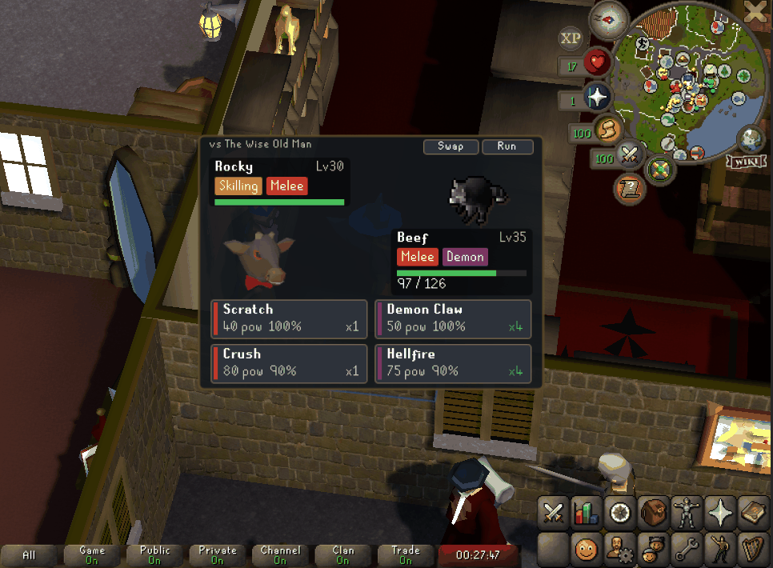

# Pet Battles

A RuneLite plugin that turns your Old School RuneScape collection log pets into a
turn-based battle team. Collect pets in-game to unlock them, level them up by
playing the game with them out, and pit them against themed AI trainers.



> **[Browse all trainers and the full type chart →](https://osrs-petbattle-gm.github.io/osrs-pet-battles/)**
> A standalone reference page listing every trainer, their party, and the type-effectiveness
> matrix, published via GitHub Pages. The source lives at [`docs/index.html`](docs/index.html)
> if you'd rather view it locally.

## Features

- **Real collection log sync** — open your Collection Log in-game (any pets page)
  and every pet you actually own joins your roster. New drops unlock live via the
  collection log chat message, and any pet seen following you is unlocked too.
- **10 OSRS-flavored types** — the combat triangle (Melee > Ranged > Magic > Melee)
  plus Fire, Ice, Nature, Undead, Demon, Dragon, and Skilling. Ranged beats Dragon
  (dragon hunter crossbow), Magic beats Demon (demonbane), Fire cremates Undead,
  Ice freezes Dragons, and everything bullies Skilling pets — except Nature,
  which they chop down.
- **Leveling with your gameplay** — your active follower pet gains XP whenever you
  kill an NPC, with a 3x *home-turf bonus* for killing its own boss (take Vet'ion Jr.
  to fight Vet'ion). Winning trainer battles also grants XP.
- **Learnsets and movesets** — pets learn new moves at level thresholds and can
  equip up to 4 at a time from the side panel.
- **Hidden easter egg moves** — certain actions with the right pet following unlock
  secret moves. Try chopping a tree with your Beaver out... there are more.
- **Pet metamorphosis** — pets that can be metamorphosed in-game (a white Phoenix, a
  different-altar Rift guardian, and friends) declare alternate *variants*. Perform the
  metamorphosis in OSRS and the plugin detects it, swapping in the variant's sprite and name
  across every screen automatically.
- **46 themed trainers** — an eight-fight story ladder from Party Pete (easy) to the Wise Old
  Man (endgame), all 23 skillcape masters, wandering Men and Guards, plus random-event
  challengers (Genie, Drunken Dwarf, Evil Bob, …) that surface on a periodic **Random Battle**
  cadence echoing OSRS's own random events. [See the full roster.](https://osrs-petbattle-gm.github.io/osrs-pet-battles/)
- **Interactive battle overlay** — a turn-based battle scene drawn over the game:
  HP bars, type badges, a battle log, and clickable move buttons.

## Getting started

1. Enable the plugin and log in.
2. Open your **Collection Log** and view a pets page to sync your roster
   (the "Other > All Pets" page covers everything at once).
3. In the Pet Battles side panel, add up to 3 pets to your team.
4. Pick a trainer and hit **Fight!**

Progress is saved per RS account through RuneLite's config service.

Note: the "new collection log addition" live unlock requires the in-game setting
*Collection log - new addition notification* to be enabled (a chat message).

## Development

Standard RuneLite external plugin layout:

```
gradlew.bat build     # compile + run all unit tests
gradlew.bat test      # engine and content validation tests
gradlew.bat run       # launch RuneLite in developer mode with the plugin loaded
```

The battle engine (`com.petbattles.engine`) is pure Java with no RuneLite
dependencies and all randomness injected — fully deterministic under test.
Opponents implement `OpponentController`, the seam where Party-service PvP can
be added later. Content (species, moves, trainers, type chart) lives in JSON
resources under `src/main/resources/com/petbattles/data/` and is validated by
`ContentValidationTest`.

### Developer mode

Dev-only affordances (unlock-all, XP multipliers, remote battles, the progression-reset
button) are gated behind a runtime flag so a normal user never sees them. Launch the client
in dev mode with:

```
gradlew.bat run -Pdev        # sets -Dpetbattles.dev=true
```

Without the flag the dev config section is empty and inert — matching what ships to the plugin hub.
